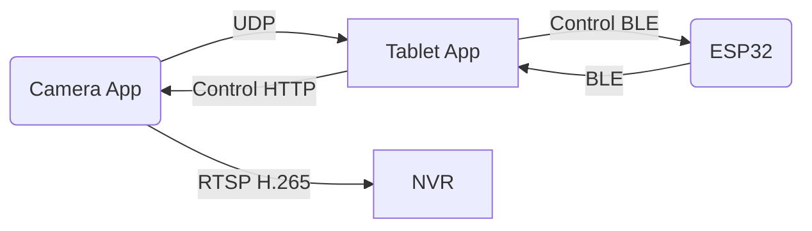

# Open Measure Hardware

> An open‑source hardware & software platform for simultaneous **length, width, height, weight** and **video** measurement, with live streaming and NVR recording support.

<!-- Badges placeholder -->

## Table of Contents
- [Features](#features)
- [System Architecture](#system-architecture)
- [Repository Layout](#repository-layout)
- [Getting Started](#getting-started)
- [Usage](#usage)
- [Communication Protocols](#communication-protocols)
- [License](#license)
- [Contributing](#contributing)
- [Roadmap](#roadmap)
- [Acknowledgements](#acknowledgements)
- [中文说明](#中文说明)

## Features
- **Optical length & width** measurement using a smartphone camera and pixel‑to‑real‑world calibration
- **Height** measurement via ultrasonic/ToF sensor driven by an **ESP32**
- **Weight** measurement with 4 full‑bridge load cells + **HX711**
- **Real‑time data push**
  - UDP: length & width ➜ Tablet
  - BLE: weight & height ➜ Tablet
- **Tablet control panel**
  - Tare (zero) command to ESP32
  - Trigger measure / capture photo / start‑stop video
- **H.265 RTSP** live stream, compatible with Hikvision NVR / iVMS‑4200
- **Open‑source** hardware (CERN‑OHL‑P v2.0) and software (Apache 2.0)

## System Architecture
### Hardware Components
| Part | Qty | Notes |
|------|-----|-------|
| ESP32‑WROOM‑32 | 1 | Wi‑Fi & BLE |
| HX711 | 1 | 24‑bit ADC |
| Load cell (full bridge) | 4 | 5 kg each |
| Ultrasonic sensor (HC‑SR04) / VL53L0X ToF | 1 | Height |
| Smartphone (Android ≥ 10) | 1 | Camera & UDP/RTSP |
| Tablet (Android) | 1 | Data dashboard |

### Data Flow


## Repository Layout
```
/hardware/          # KiCad schematics, PCB, 3D STEP, BOM
/firmware/esp32/    # ESP‑IDF source (BLE, HX711, SR04)
/mobile-app/        # Android Kotlin camera & UDP/RTSP
/tablet-app/        # Android Jetpack Compose dashboard
/docs/              # Additional docs & diagrams
LICENSE
README.md
```

## Getting Started
### Prerequisites
- **Hardware** assembled as per `/hardware/README`
- **Software**  
  - ESP‑IDF 5.x  
  - Android Studio 2025.2  
  - Python 3.10 (build scripts)

### Hardware Setup
1. Solder load cells into Wheatstone bridge and connect to HX711.
2. Wire HX711 `DT` ➜ GPIO 4, `SCK` ➜ GPIO 5 on ESP32.
3. Attach ultrasonic sensor: `TRIG` ➜ GPIO 12, `ECHO` ➜ GPIO 13.
4. Flash firmware:  
   ```bash
   cd firmware/esp32
   idf.py -p /dev/ttyUSB0 flash monitor
   ```

### Mobile Camera App
```bash
cd mobile-app
./gradlew installDebug
```
Configure calibration: place a known‑size checkerboard, follow the in‑app wizard.

### Tablet App
```bash
cd tablet-app
./gradlew installRelease
```
Set ESP32 BLE name and smartphone UDP IP in *Settings*.

## Usage
1. Power on ESP32; wait for the BLE peripheral **OMH‑ESP32** to appear.
2. Launch **OMH Dashboard** on tablet ➜ *Connect*.
3. Open **OMH Camera** on phone ➜ *Start Stream*.  
   ‑ RTSP URL appears: `rtsp://phone-ip:8554/omh`
4. Tablet:
   - Press **Tare** to zero the scale.
   - Place object; press **Measure**.  
     Length, Width, Height, Weight show in real‑time.
   - *Capture* saves JPG; *Record* toggles MP4 (saved locally & to NVR).

### Hikvision NVR
Add a custom RTSP camera with URL above; choose **H.265** codec.

## Communication Protocols
### UDP Payload
```json
{ "length_mm": 123.4, "width_mm": 56.7, "timestamp": 1623456789 }
```
### BLE GATT
- **Service UUID**: 70F1xxxx...
- **Characteristic: weight_kg** (float32)
- **Characteristic: height_mm**

Commands: `0x01` Tare, `0x02` Measure.

## License
- **Hardware**: CERN‑OHL‑P v2.0 – see `/LICENSE-HW`
- **Software**: Apache 2.0 – see `/LICENSE`

## Contributing
PRs and issues welcome! Please read `CONTRIBUTING.md`.

## Roadmap
- Wi‑Fi MQTT gateway  
- Multi‑point calibration wizard  
- Web dashboard

## Acknowledgements
- HX711 library by Bogdan Necula  
- RTSP Camera library by Pedro SG

## 中文说明
[README_zh.md](docs/README_zh.md)（即将推出）

---

*Made with ❤️ in 2025*

