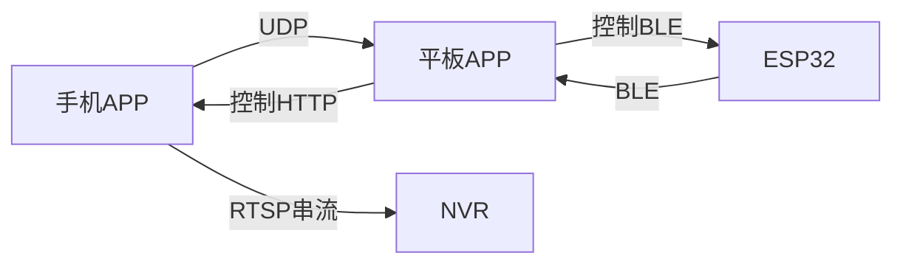

# Open Measure Hardware 中文说明

> 本项目是一个开源硬件与软件平台，支持同时测量 **长、宽、高、重量** 及**视频拍摄与录制**，可实时串流到 NVR 录像机或平板界面。

---

## 📦 项目特色

- 📷 **手机相机** 用于识别物体边界，实现光学方式测量 **长宽**
- 📏 **超声波 / ToF 传感器** 测量 **高度**
- ⚖️ **4 个全桥传感器 + HX711** 精准测量 **重量**
- 📡 实时通讯：
  - UDP：长度、宽度 ➜ 平板显示
  - BLE：高度、重量 ➜ 平板同步
- 📱 **平板控制界面**：归零、测量、拍照、录像
- 🎥 **支持 RTSP (H.265)** 视频串流，可连接海康 NVR 或 iVMS‑4200
- 🔓 完全开源硬件（CERN-OHL-S v2.0）+ 软件（Apache 2.0）

---

## 🔧 系统架构

### 📘 硬件组成

| 组件                  | 数量 | 说明              |
| ------------------- | -- | --------------- |
| ESP32-WROOM-32      | 1  | 负责 BLE 与传感器控制   |
| HX711               | 1  | 24位 ADC 模拟转数字   |
| 全桥称重传感器             | 4  | 每个 5kg，组成一体称重台  |
| 超声波或 ToF 传感器        | 1  | 测量高度            |
| 安卓手机 (Android ≥ 10) | 1  | 识别物体边界并 UDP 发送  |
| 安卓平板                | 1  | BLE 接收数据并控制操作界面 |

### 📊 数据流图



---

## 📁 仓库结构

```
/hardware/         # 原理图、电路板、3D模型与 BOM 表
/firmware/esp32/   # ESP-IDF 驱动代码（BLE、HX711、超声波）
/mobile-app/       # Android 手机相机程序
/tablet-app/       # 平板控制界面（Jetpack Compose）
/docs/             # 文档、接线图等
LICENSE            # 软件协议：Apache 2.0
LICENSE-HW         # 硬件协议：CERN-OHL-S v2.0
README.md          # 英文说明
README_zh.md       # 中文说明
```

---
📎 **提示**： `hardware/pcb/PCB_2025-07-07.json` 为嘉立创 EDA 工程文件， 可直接在 [嘉立创 EDA 平台](https://lceda.cn/) 打开，进行 PCB 编辑或打样下单。
## 🚀 快速开始

### 安装准备

- 焊接称重传感器并接入 HX711
- 超声波/ToF模块连接至 ESP32
- 手机与平板安装对应 APP

### 编译固件

```bash
cd firmware/esp32
idf.py -p /dev/ttyUSB0 flash monitor
```

### 安装 Android APP

```bash
cd mobile-app
./gradlew installDebug

cd tablet-app
./gradlew installRelease
```

APP 设置中输入 BLE 名称、UDP IP。

---

## 🎮 使用方法

1. 上电 ESP32，等待 BLE 设备名称出现（如：`OMH-ESP32`）
2. 打开平板控制面板，连接 BLE
3. 手机打开相机界面，开始串流（显示 RTSP 地址）
4. 平板界面：
   - 【归零】：将电子秤清零
   - 【测量】：开始读取 长、宽、高、重量
   - 【拍照 / 录像】：本地保存，也推送至 NVR

### 💡 Hikvision NVR 设置

在 NVR 中添加手动 RTSP 摄像头（格式 `rtsp://手机IP:8554/omh`），编码选择 H.265

---

## 📡 通讯协议说明

### UDP 数据包（长宽）

```json
{ "length_mm": 123.4, "width_mm": 56.7, "timestamp": 1623456789 }
```

### BLE GATT 特征值

- weight\_kg：浮点数，公斤
- height\_mm：整型，高度（毫米）

指令：

- `0x01`：归零
- `0x02`：测量

---

## 📜 协议声明

- 软件使用：Apache License 2.0 许可（详见 [LICENSE](./LICENSE)）
- 硬件使用：CERN-OHL-S v2.0 开源硬件协议（详见 [LICENSE-HW](./LICENSE-HW)）

> 🚫 本项目不附带任何形式的质量或适用性担保。

---

## 🙌 致谢

- HX711 驱动库：Bogdan Necula
- Android RTSP 相机组件：Pedro SG

---

> 本项目由热爱开源与测量系统的开发者在 2025 年设计开发。欢迎 Fork、改进或部署。

Made with ❤️ in 2025


